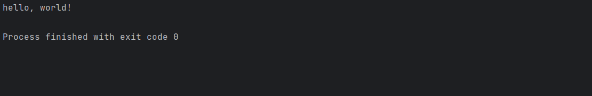

# 安装Node

## node版本

node版本最好是16版本，16是比较稳定的版本

下载地址：

https://nodejs.org/zh-cn/download/

在下载页选择合适的安装包进行下载

::: tip
.msi是Windows installer开发出来的程序安装文件，它可以让你安装，修改，卸载你所安装的程序。说白了.msi就是Windows installer的数据包，把所有和安装文件相关的内容封装在一个包里。此外：它还包含有关安装过程自己的信息。例如：安装序列、目标文件夹路径、安装选项和控制安装过程的属性。

.zip是一个压缩包，解压之后即可，不需要安装
:::

## 开始安装

一直点击next安装就行，不用修改。


安装路径可以自定义，也可以用默认地址,安装node是不用自己配置环境变量的，它会自动配置好。


至此已经安装完成

## 验证安装成功

安装完成后去环境变量->系统变量->Path查看是否有nodejs


我们还可以在cmd窗口查看

执行以下命令查看node版本

```bash
node -v
```
执行以下命令查看npm版本

```bash
npm -v
```

默认情况下，执行npm install -g xxx时， 下载了一个全局包，这个包的默认存放路径为C:\User\82032\AppData\Roaming\npm\node_modules下
，可使用命令npm root -g查看。

此处准备一些常用命令

```bash
C:\Users\Administrator>
  ╔════════════════════════════════════════════════════════════════════════╗
  ║ npm -v：查看npm安装的版本。                                                        
  ║                                                                        
  ║ npm init：会引导你建立一个package.json文件，包括名称、版本、作者等信息。          
  ║                                                                        
  ║ npm list：查看当前目录下已安装的node包。                                    
  ║                                                                       
  ║  npm ls：查看当前目录下已安装的node包。                                      
  ║                                                                        
  ║  npm install moduleNames：安装Node模块到本地目录node_modules下。            
  ║                                                                        
  ║  npm install < name > -g：将包安装到全局环境中。                                         
  ║                                                                       
  ║  npm install < name > --save：安装的同时，将信息写入package.json中，         
  ║  直接使用npm install方法就能够根据dependencies配置安装全部的依赖包。            
  ║                                                                        
  ║  npm install < name> --save-dev：安装的同时，将信息写入package.json中       
  ║  直接使用npm install方法就能够根据devDependencies配置安装全部的依赖包。         
  ║                                                                        
  ║  npm uninstall moudleName：卸载node模块。                                
  ║                                                                        
  ╚════════════════════════════════════════════════════════════════════════╝
```

接下来使用node去运行一个JavaScript文件，打印Hello， World！

```js
console.log('hello, world!')
```

## 运行helloworld

创建helloworld.js文件，在编译器或者cmd中运行

```bash
node helloworld.js
```


